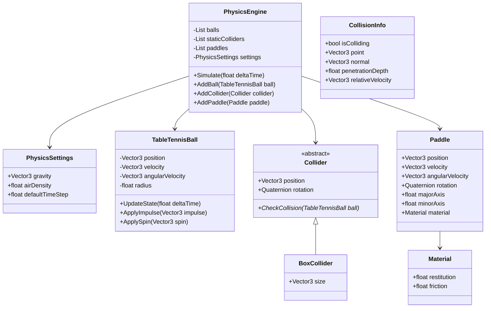

```mermaid
classDiagram
    class PhysicsEngine {
        -List<TableTennisBall> balls
        -List<Collider> staticColliders
        -List<Paddle> paddles
        -PhysicsSettings settings
        +Simulate(float deltaTime)
        +AddBall(TableTennisBall ball)
        +AddCollider(Collider collider)
        +AddPaddle(Paddle paddle)
    }

    class PhysicsSettings {
        +Vector3 gravity
        +float airDensity
        +float defaultTimeStep
    }

    class TableTennisBall {
        -Vector3 position
        -Vector3 velocity
        -Vector3 angularVelocity
        -float radius
        +UpdateState(float deltaTime)
        +ApplyImpulse(Vector3 impulse)
        +ApplySpin(Vector3 spin)
    }

    class Collider {
        <<abstract>>
        +Vector3 position
        +Quaternion rotation
        +CheckCollision(TableTennisBall ball)*
    }

    class BoxCollider {
        +Vector3 size
    }

    class Paddle {
        +Vector3 position
        +Vector3 velocity
        +Vector3 angularVelocity
        +Quaternion rotation
        +float majorAxis
        +float minorAxis
        +Material material
    }

    class Material {
        +float restitution
        +float friction
    }

    class CollisionInfo {
        +bool isColliding
        +Vector3 point
        +Vector3 normal
        +float penetrationDepth
        +Vector3 relativeVelocity
    }

    PhysicsEngine --> PhysicsSettings
    PhysicsEngine --> TableTennisBall
    PhysicsEngine --> Collider
    PhysicsEngine --> Paddle
    Collider <|-- BoxCollider
    Paddle --> Material
```